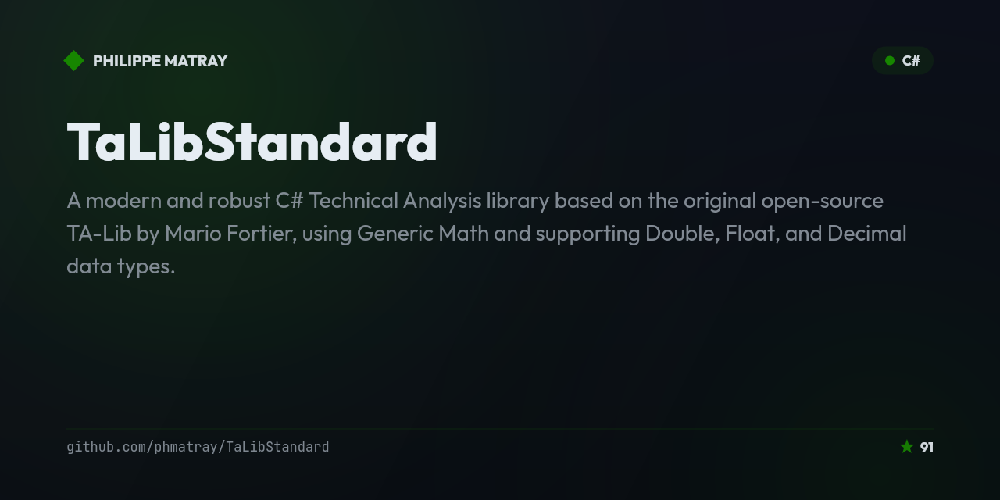

# TaLibStandard
[](https://stars.medv.io/phmatray/TaLibStandard)

A modern and robust C# Technical Analysis library based on the original open-source [TA-Lib](https://ta-lib.org) by Mario Fortier, using Generic Math and supporting Double, Float, and Decimal data types.

---

[](https://github.com/phmatray/TaLibStandard "Go to GitHub repo")
[](https://www.gnu.org/licenses/gpl-3.0.html)
[](https://github.com/phmatray/TaLibStandard)
[](https://github.com/phmatray/TaLibStandard)

[](https://github.com/phmatray/TaLibStandard/releases/)
[](https://github.com/phmatray/TaLibStandard/issues)
[](https://github.com/phmatray/TaLibStandard/pulls)
[](https://github.com/phmatray/TaLibStandard/graphs/contributors)
[](https://github.com/phmatray/TaLibStandard/commits/master)
[](https://github.com/phmatray/TaLibStandard/actions/workflows/ci-cd.yml)
[](https://app.codecov.io/gh/phmatray/TaLibStandard/tree/main)
[](https://app.codacy.com/gh/phmatray/TaLibStandard/dashboard)

---

## 📝 Table of Contents

<!-- TOC -->
* [TaLibStandard](#talibstandard)
  * [📝 Table of Contents](#-table-of-contents)
  * [📚 Introduction](#-introduction)
  * [🎯 Goal](#-goal)
  * [🏁 Getting started](#-getting-started)
  * [📌 Features](#-features)
    * [Roadmap (next features)](#roadmap-next-features)
  * [📄 Documentation](#-documentation)
  * [📖 Guides](#-guides)
  * [📥 Installation](#-installation)
    * [📋 Prerequisites](#-prerequisites)
    * [🚀 We use the latest C# features](#-we-use-the-latest-c-features)
    * [📦 NuGet Packages](#-nuget-packages)
    * [🧪 Tests Specifications](#-tests-specifications)
  * [💾 Installation](#-installation-1)
  * [🧑‍💻 Usage](#-usage)
  * [🧩 Samples](#-samples)
  * [⚡ Benchmarks](#-benchmarks)
  * [📊 Code Quality](#-code-quality)
  * [❓ Issues and Feature Requests](#-issues-and-feature-requests)
  * [🤝 Contributing](#-contributing)
  * [🌟 Contributors](#-contributors)
  * [✉️ Contact](#-contact)
  * [📝 Release notes](#-release-notes)
  * [📜 License](#-license)
<!-- TOC -->

## 📚 Introduction

TaLibStandard is a modern interpretation of the widely used [TA-Lib](https://ta-lib.org), reimagined in C# 14. It is designed to be reliable, efficient, and user-friendly for developers performing financial market analysis. The addition of .NET's Generic Math feature allows for a richer, more flexible library that can handle a variety of number types.

## 🎯 Goal

The primary objective of TaLibStandard is to provide a comprehensive, feature-rich and accessible library for conducting technical analysis on financial market data.

## 🏁 Getting started

To get started with TaLibStandard, read the [getting started guide](./docs/guides/getting-started.md) —
it covers installation, your first indicator, and the output-alignment rule that everything else depends
on. Then clone the repository and explore the runnable projects in the [`samples`](./samples) directory
(see [Samples](#-samples)). For a comprehensive overview of the library's capabilities, refer to the
[indicator catalog](./docs/indicators/README.md) or the flat list of
[available functions](./docs/functions.md).

## 📌 Features

* [x] Support for Double, Float, and Decimal data types, with the help of .NET's Generic Math
* [x] With some basic tests (coverage: >= 80%)
* [x] .NET Exception handling (BREAKING CHANGE)

### Roadmap (next features)

* [ ] Comprehensive API documentation that is easy to understand
* [x] High-Level API for common use cases — see the [fluent API guide](./docs/guides/fluent-api.md)
* [ ] Support for more data types
* [ ] Support for more functions
* [ ] More tests
* [x] More examples — see [Samples](#-samples)
* [x] Add a Benchmark project — see [Benchmarks](#-benchmarks)
* [ ] Create a gRPC server to expose the library as a service

## 📄 Documentation

**TaLibStandard** provides a [COMPLETE DOCUMENTATION](https://github.com/phmatray/TaLibStandard/blob/main/docs/README.md) of the library.

All summaries are written in English. If you want to help us translate the documentation, please open an issue to
discuss it.

> **Note:** The documentation is generated using [Doraku/DefaultDocumentation]() tool. It is generated automatically when the project is built.

## 📖 Guides

Hand-written guides live in [`docs/guides`](./docs/guides), and every public entry point is catalogued in
[`docs/indicators`](./docs/indicators/README.md).

| Guide | What it covers |
|-------|----------------|
| [🏁 Getting started](./docs/guides/getting-started.md) | Installation, your first indicator, and the three things that trip everyone up: `RetCode`, `BegIdx`/`NBElement` output alignment, and the `double` / `float` / `decimal` story. **Start here.** |
| [✨ Fluent API](./docs/guides/fluent-api.md) | `PriceSeries` in, bar-indexed `IndicatorSeries` out — the layer that does the `BegIdx`/`NBElement` arithmetic for you, with `null` for a bar that has not warmed up. Warm-up semantics, crossings, `AsOf`, the nine shipped indicators and the `Align` escape hatch to the rest. |
| [📋 Indicator catalog](./docs/indicators/README.md) | Every `TAMath` and `TACandle` entry point, grouped by category, with signatures, defaults, outputs and links to the generated API pages. |
| [📡 Real-time streaming](./docs/guides/real-time-streaming.md) | Ticks → bars → indicators over SignalR and raw WebSocket: architecture, message contracts, warm-up semantics and production notes. |
| [📉 Backtesting](./docs/guides/backtesting.md) | The engine model, the structurally enforced no-look-ahead guarantee, the cost model, every metric with its formula, and how to write your own strategy. |
| [📈 TradingView integration](./docs/guides/tradingview-integration.md) | Pine Script `ta.*` → `TAMath` mapping, parity caveats, UDF datafeed and Lightweight Charts wiring, alert-webhook security. |
| [⚡ Benchmarks](./docs/guides/benchmarks.md) | What the benchmark suite measures, how to run it, how to read BenchmarkDotNet output, and the measured results. |

## 📥 Installation

### 📋 Prerequisites

- .NET 10.0 (supported versions: 10.x)
- A C# IDE (Visual Studio, JetBrains Rider, etc.)
- A C# compiler (dotnet CLI, etc.)

### 🚀 We use the latest C# features

This library targets .NET 10.0 and uses the latest C# features. It is written in C# 14.0 and uses the new `init`
properties, `record` types, `switch` expressions, `using` declarations and more.

I invite you to read the [C# 14.0 documentation](https://learn.microsoft.com/en-us/dotnet/csharp/whats-new/csharp-14) to
learn more about these features.

### 📦 NuGet Packages

| Package Name                         | NuGet Version Badge                                                                                                                                      | NuGet Downloads Badge                                                                                                                                     | Package Explorer                                                            |
|--------------------------------------|----------------------------------------------------------------------------------------------------------------------------------------------------------|-----------------------------------------------------------------------------------------------------------------------------------------------------------|-----------------------------------------------------------------------------|
| Atypical.TechnicalAnalysis.Candles   | [](https://www.nuget.org/packages/Atypical.TechnicalAnalysis.Candles)     | [](https://www.nuget.org/packages/Atypical.TechnicalAnalysis.Candles)     | [Explore](https://nuget.info/packages/Atypical.TechnicalAnalysis.Candles)   |
| Atypical.TechnicalAnalysis.Functions | [](https://www.nuget.org/packages/Atypical.TechnicalAnalysis.Functions) | [](https://www.nuget.org/packages/Atypical.TechnicalAnalysis.Functions) | [Explore](https://nuget.info/packages/Atypical.TechnicalAnalysis.Functions) |
| Atypical.TechnicalAnalysis.Core      | [](https://www.nuget.org/packages/Atypical.TechnicalAnalysis.Common)       | [](https://www.nuget.org/packages/Atypical.TechnicalAnalysis.Common)       | [Explore](https://nuget.info/packages/Atypical.TechnicalAnalysis.Common)    |

This table is automatically updated regularly the latest developments and releases in the Atypical Technical Analysis suite.

### 🧪 Tests Specifications

  * Target framework : .NET 10
  * Language version : C# 14
  * xUnit and Shouldly 

## 💾 Installation

To install TaLibStandard, you can use the NuGet package manager. Run the following command in your terminal:

```shell
dotnet add package Atypical.TechnicalAnalysis.Candles
dotnet add package Atypical.TechnicalAnalysis.Functions
```

## 🧑‍💻 Usage

TaLibStandard exposes three APIs over the same indicators: a **fluent** API (`PriceSeries` /
`IndicatorSeries`) that hands you values addressed by bar index, a **`TAMath`** API that returns a
strongly-typed result record carrying TA-Lib's raw output array and its alignment metadata, and a
low-level **`TAFunc`** API that mirrors the original TA-Lib C signature (`ref`/`in` parameters,
pre-allocated output arrays).

### Fluent API (`PriceSeries` → `IndicatorSeries`)

```csharp
using TechnicalAnalysis.Functions;

PriceSeries prices = PriceSeries.FromHlc(highs, lows, closes);

double? rsi = prices.Rsi(14).Latest;          // null until the indicator has warmed up
double? atr = prices.Atr(14).Latest;

IndicatorSeries fast = prices.Sma(5);
IndicatorSeries slow = prices.Sma(20);
bool goldenCross = fast.CrossedAbove(slow, bar: prices.BarCount - 1);
```

Every index is a **bar** index, and a bar the indicator has not reached yet is `null` — never `0.0`.
See the [fluent API guide](./docs/guides/fluent-api.md).

### `TAMath` — the raw result record

```csharp
using TechnicalAnalysis.Functions;

double[] closingPrices = [.. /* your OHLCV data */];

// RsiResult exposes RetCode, BegIdx, NBElement and the Real[] output array
RsiResult rsi = TAMath.Rsi(0, closingPrices.Length - 1, closingPrices, timePeriod: 14);

if (rsi.RetCode == RetCode.Success && rsi.NBElement > 0)
{
    // The newest value is at array index NBElement - 1, and it describes
    // bar BegIdx + NBElement - 1. Those are two different numbers.
    double latestRsi = rsi.Real[rsi.NBElement - 1];
}
```

### Low-level API (`TAFunc`) — original TA-Lib signature

```csharp
using TechnicalAnalysis.Functions;

double[] closes = [.. data.Select(d => (double)d.Close)];
double[] outReal = new double[closes.Length];
int outBegIdx = 0;
int outNbElement = 0;
int period = 14;

RetCode result = TAFunc.Rsi(
    0, closes.Length - 1,
    in closes,
    in period,
    ref outBegIdx,
    ref outNbElement,
    ref outReal);

double[] rsiValues = outReal.Take(outNbElement).ToArray();
```

### Candlestick pattern recognition

```csharp
using TechnicalAnalysis.Candles;

// Detects the "Short Line" candle pattern over the given OHLC arrays
CandleIndicatorResult pattern = TACandle.CdlShortLine(
    0, closes.Length - 1, opens, highs, lows, closes);
```

Both `TAFunc` and `TAMath` overloads are generic-math friendly and accept `double[]` or `float[]`
inputs. See the [full function list](./docs/functions.md) for every available indicator and
candlestick pattern, and the [Demo.BlazorWasm](./Demo.BlazorWasm) project for a working end-to-end
example that charts these indicators.

> **One rule to internalise before anything else.** `TAMath` fills its output array from index `0`, not
> from the input index it corresponds to. Output element `k` describes **input index `BegIdx + k`**, for
> `k` in `[0, NBElement)`; everything from `NBElement` onwards is a meaningless zero. Getting this wrong
> shifts every signal in time, silently. The [getting started guide](./docs/guides/getting-started.md)
> works through it with a hand-checkable example, and the
> [fluent API](./docs/guides/fluent-api.md) does the arithmetic for you in one tested place.

## 🧩 Samples

Runnable projects, all completely offline — no market data provider, no API key, no network calls.

| Sample | Run it | Guide |
|--------|--------|-------|
| [**Real-time streaming**](./samples/TechnicalAnalysis.Samples.RealTime)<br/>ASP.NET Core server: synthetic tick feed → OHLCV bars → seven indicators (eleven series) per closed bar, published over a SignalR hub *and* a raw WebSocket, plus a zero-dependency browser dashboard. | `dotnet run --project samples/TechnicalAnalysis.Samples.RealTime -c Release`<br/>then open <http://localhost:5199> | [📡 Real-time streaming](./docs/guides/real-time-streaming.md) |
| [**Real-time console client**](./samples/TechnicalAnalysis.Samples.RealTime.Client)<br/>SignalR client for the server above; exercises both the group-push and the server-streaming paths. | `dotnet run --project samples/TechnicalAnalysis.Samples.RealTime.Client -c Release -- --symbol GLOBEX` | [📡 Real-time streaming](./docs/guides/real-time-streaming.md) |
| [**Backtesting**](./samples/TechnicalAnalysis.Samples.Backtesting)<br/>Bar-by-bar engine with a structurally enforced no-look-ahead guarantee, a commission/slippage cost model, a full metrics suite and five strategies compared side by side. | `dotnet run --project samples/TechnicalAnalysis.Samples.Backtesting -c Release` | [📉 Backtesting](./docs/guides/backtesting.md) |
| [**Blazor WebAssembly demo**](./Demo.BlazorWasm)<br/>Interactive browser demo charting the indicators. | `dotnet run --project Demo.BlazorWasm` | — |

## ⚡ Benchmarks

[`benchmarks/TechnicalAnalysis.Benchmarks`](./benchmarks/TechnicalAnalysis.Benchmarks) is a
BenchmarkDotNet suite of **119 benchmarks** over deterministic synthetic market data at three series
lengths (1 000 / 10 000 / 100 000), all with `[MemoryDiagnoser]`. Every indicator in the overlap,
momentum and volatility/volume suites is measured **twice** — once through the allocation-free `TAFunc`
API and once through the ergonomic `TAMath` API — so the cost of convenience is a number rather than a
guess. Candlestick patterns are measured on `double`, `float` **and** `decimal` to price the
generic-math design.

```shell
# see what is there, without running anything
dotnet run --project benchmarks/TechnicalAnalysis.Benchmarks -c Release -- --list flat

# prove every benchmark computes something valid (fast; not a measurement)
dotnet run --project benchmarks/TechnicalAnalysis.Benchmarks -c Release -- --selfcheck

# one suite
dotnet run --project benchmarks/TechnicalAnalysis.Benchmarks -c Release -- --anyCategories Momentum
```

An optional sixth suite compares the managed port head to head against the original TA-Lib C library
through P/Invoke, with an equivalence assertion that runs *before* anything is timed. It is enabled
automatically when the native library is found and silently skipped when it is not, so the suite has no
native dependency.

See the [benchmarks guide](./docs/guides/benchmarks.md) for the full switch reference, the native
install instructions per platform, how to read every output column, the measured results and the
methodology caveats.

## 📊 Code Quality

We strive for the highest code quality in TaLibStandard, leveraging Codacy—an automated code analysis/quality tool. Codacy provides static analysis, cyclomatic complexity measures, duplication identification, and code unit test coverage changes for every commit and pull request.

View our Codacy metrics [here](https://app.codacy.com/gh/phmatray/TaLibStandard).

## ❓ Issues and Feature Requests

For reporting bugs or suggesting new features, kindly submit these as an issue to the [TaLibStandard Repository](https://github.com/phmatray/TaLibStandard/issues). We value your contributions, but before submitting an issue, please ensure it is not a duplicate of an existing one.

<!-- portfolio-techstack:start -->

## Tech Stack

- **.NET 10**
- Microsoft.AspNetCore.Components.WebAssembly
- Microsoft.AspNetCore.Components.WebAssembly.DevServer
- Microsoft.DotNet.HotReload.WebAssembly.Browser
- MudBlazor
- PublishSPAforGitHubPages.Build
- DefaultDocumentation

<!-- portfolio-techstack:end -->

## 🤝 Contributing

We welcome contributions from the community! If you'd like to contribute to TaLibStandard, please fork the repository and submit a pull request. For major changes, please open an issue first to discuss what you would like to change.

## 🌟 Contributors

[](http://contrib.rocks)

## ✉️ Contact

You can contact us by opening an issue on this repository.

## 📝 Release notes

### v3.0.0 (January 2026) - .NET 10 LTS Release 🎉

**Breaking Changes:**
- **Upgraded to .NET 10 LTS** - Framework support extended until November 2028
- **C# 14 Language Features** - Utilizing the latest C# capabilities
- **Updated Dependencies** - All major packages updated to .NET 10 compatible versions
- **Minimum .NET Version:** Now requires .NET 10.0 SDK

**Major Improvements:**
- **Code Quality:** Extensive refactoring eliminated ~1,200 lines of duplicated code
- **Validation Consolidation:** Unified validation patterns across 99 indicators
- **Result Classes:** Consolidated result types with inheritance hierarchy
- **Mathematical Functions:** Template-based approach for 60+ math indicators
- **Lookback Validation:** Standardized lookback calculations for 87 indicators
- **Code Cleanup:** Removed unused code and consolidated common patterns

**Performance:**
- All 898 tests passing
- No performance degradation
- Maintained backward compatibility in algorithms

**Documentation:**
- Auto-generated API documentation updated
- All function and candle pattern docs regenerated

For migration guide from v2.x to v3.0, see [Migration from v2 to v3](#migration-from-v2-to-v3).

### Previous Releases

- v2.0.0 (June 2025) - Major release with .NET Exception handling
- v1.0.0 (June 2025) - First stable release
- v0.4.0 (June 2025) - Generic Math support
- v0.3.1 (June 2025) - Bug fixes and improvements
- v0.3.0 (June 2025) - Enhanced functionality
- v0.2.0 (June 2025) - Additional indicators
- v0.1.0 (November 2023) - Initial release

## Migration from v2 to v3

### Prerequisites
- **Update to .NET 10 SDK:** Download from [dotnet.microsoft.com](https://dotnet.microsoft.com/download)
- **Update project target framework:**
  ```xml
  <TargetFramework>net10.0</TargetFramework>
  ```

### Breaking Changes

1. **Framework Requirement**
   - Minimum version: .NET 10.0
   - Projects targeting .NET 9 or earlier must upgrade

2. **Package Dependencies**
   - If you reference TaLibStandard packages, ensure your project can target .NET 10.0
   - Update any conflicting package versions

### API Compatibility
- **No API breaking changes** - All public method signatures remain the same
- **No behavioral changes** - All algorithms produce identical results
- Code that worked with v2.x will work with v3.0 after framework upgrade

### Testing Your Migration
```csharp
// No code changes needed - same API as v2.x
var rsiResult = TAFunc.Rsi(0, closePrices.Length - 1, closePrices, 14,
    ref outBegIdx, ref outNBElement, ref rsiValues);
```

## 📜 License

GNU General Public License v3.0 or later.
