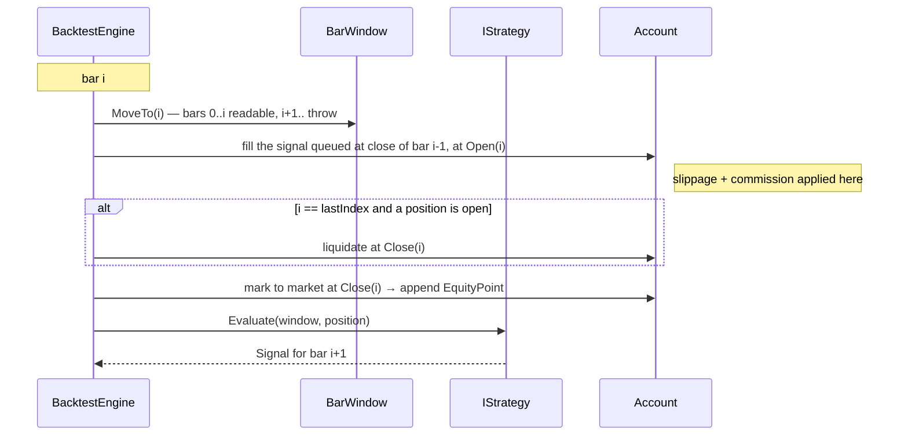

# 📉 Backtesting with TaLibStandard

A backtest is a machine for producing convincing numbers. Most of the work in building one goes into
making sure those numbers are not lies. The sample in
[`samples/TechnicalAnalysis.Samples.Backtesting`](../../samples/TechnicalAnalysis.Samples.Backtesting) is
a single-instrument, bar-by-bar engine whose design is organised around exactly two lies:

1. **Look-ahead bias** — a strategy reading data it could not have had. Prevented *structurally* here:
   the types make it impossible, and an attempt throws `LookAheadException` rather than reporting an
   impossible Sharpe ratio.
2. **Misaligned indicators** — reading TA-Lib's output array as if element `k` described bar `k`. This
   shifts every signal in time by `BegIdx` bars and is completely silent. The sample performs that
   mapping in exactly one place.

It ships with a 220-test suite that includes five deliberately cheating strategies, each proven to be
unable to profit from the cheat.

---

## 📝 Table of contents

<!-- TOC -->
* [📉 Backtesting with TaLibStandard](#-backtesting-with-talibstandard)
  * [📝 Table of contents](#-table-of-contents)
  * [🏁 Run it](#-run-it)
    * [Command line](#command-line)
    * [What it prints](#what-it-prints)
  * [🏗️ The engine model](#-the-engine-model)
    * [The execution timeline](#the-execution-timeline)
    * [Domain types](#domain-types)
  * [🔒 The no-look-ahead guarantee](#-the-no-look-ahead-guarantee)
    * [Layer 1 — `IBarWindow`](#layer-1--ibarwindow)
    * [Layer 2 — `IndicatorSeries`](#layer-2--indicatorseries)
    * [Layer 3 — `IIndicatorSource`](#layer-3--iindicatorsource)
    * [Layer 4 — the engine's own ordering](#layer-4--the-engines-own-ordering)
  * [💸 The cost model](#-the-cost-model)
  * [📊 Metrics, formulas and annualisation](#-metrics-formulas-and-annualisation)
    * [Return and growth](#return-and-growth)
    * [Risk](#risk)
    * [Risk-adjusted](#risk-adjusted)
    * [Trade statistics](#trade-statistics)
    * [Degenerate inputs](#degenerate-inputs)
  * [✍️ Writing your own strategy](#-writing-your-own-strategy)
    * [The contract](#the-contract)
    * [A complete worked example](#a-complete-worked-example)
    * [Registering it](#registering-it)
    * [Rules of thumb](#rules-of-thumb)
  * [📄 Using your own CSV](#-using-your-own-csv)
  * [🧪 Tests](#-tests)
  * [⚠️ Limitations — read before believing any number](#-limitations--read-before-believing-any-number)
<!-- TOC -->

---

## 🏁 Run it

```shell
# from the repository root — deterministic synthetic series, fully offline
dotnet run --project samples/TechnicalAnalysis.Samples.Backtesting -c Release
```

### Command line

Verbatim `--help` output:

```text
TaLibStandard - backtesting sample

Runs four indicator strategies and a buy-and-hold baseline over the same price series,
then prints a side-by-side performance comparison. With no arguments it uses a deterministic
synthetic series, so it works completely offline.

Usage:
  dotnet run --project samples/TechnicalAnalysis.Samples.Backtesting [options]

Options:
  --csv <path>              Load bars from a CSV file instead of generating them.
                            Header required: Date,Open,High,Low,Close,Volume (any order).
  --bars <int>              Number of synthetic bars to generate. Default: 1500.
  --seed <int>              Seed of the synthetic series generator. Default: 20240101.
  --capital <double>        Starting account equity. Default: 100000.
  --commission-bps <double> Commission per fill, in basis points of notional. Default: 5.
  --slippage-bps <double>   Slippage per fill, in basis points of price. Default: 2.
  --bars-per-year <int>     Annualisation constant for CAGR, volatility, Sharpe, Sortino,
                            Calmar. Default: 252 (daily bars, equity calendar).
  --allow-short             Permit short positions. Off by default, in which case a short
                            signal simply flattens the position.
  --trade-log               Print an excerpt of each strategy's round trips.
  -h, --help                Print this text and exit.

Examples:
  dotnet run --project samples/TechnicalAnalysis.Samples.Backtesting
  dotnet run --project samples/TechnicalAnalysis.Samples.Backtesting -- --seed 7 --bars 3000 --allow-short
  dotnet run --project samples/TechnicalAnalysis.Samples.Backtesting -- --csv ./spy.csv --commission-bps 10
```

`--help` exits `0`. An unknown option prints `Unknown option '--nope'.` followed by the usage text and
exits `1`.

### What it prints

Three blocks: a run-configuration header, one card per strategy (metrics table plus an ASCII equity
curve, and the trade log when `--trade-log` is given), then a side-by-side comparison.

Real output from `dotnet run --project samples/TechnicalAnalysis.Samples.Backtesting -c Release` with no
arguments:

```text
RUN CONFIGURATION
  Data:                     deterministic synthetic series (seed 20240101)
  Bars:                     1,500
  Initial capital:          100,000.00
  Commission:               5 bp per fill
  Slippage:                 2 bp per fill
  Position sizing:          fixed fraction 100 % of equity
  Short selling:            disabled (short signals go flat)
  Annualisation:            252 bars per year
```

```text
Metric                                 SMA 20/50      RSI 14 reversion  MACD 12/26/9 + 3xATR  BBands 20/2 breakout          Buy and hold
----------------------------------------------------------------------------------------------------------------------------------------
Final equity                          166,340.21            125,211.00            166,194.08            110,927.31          * 337,583.91
Total return                             66.34 %               25.21 %               66.19 %               10.93 %            * 237.58 %
CAGR                                      8.93 %                3.85 %                8.92 %                1.76 %             * 22.70 %
Annualised volatility                    17.48 %              * 4.39 %               15.96 %               12.92 %               22.76 %
Max drawdown                             32.37 %              * 6.70 %               20.42 %               30.37 %               19.89 %
Max DD duration (bars)                       388                 * 153                   337                   679                   220
Sharpe                                      0.58                  0.88                  0.61                  0.20                * 1.01
Sortino                                     0.84                * 1.53                  0.91                  0.29                  1.50
Calmar                                      0.28                  0.58                  0.44                  0.06                * 1.14
Trades                                        17                     5                    58                    33                     1
Win rate                                 52.94 %            * 100.00 %               39.66 %               27.27 %              100.00 %
Profit factor                               2.19                 * inf                  1.54                  1.16                   inf
Average win                            13,543.04              5,042.20              8,169.21              9,031.01          * 237,583.91
Average loss                           -6,943.39                * 0.00             -3,477.08             -2,931.33                  0.00
Expectancy / trade                      3,902.37              5,042.20              1,141.28                331.13          * 237,583.91
Exposure                                 61.40 %                3.33 %               46.13 %               34.33 %               99.87 %

  * marks the best value of the row.
```

The strategy line-up is `SmaCrossoverStrategy(20, 50)`, `RsiMeanReversionStrategy()`,
`MacdTrendStrategy()`, `BollingerBreakoutStrategy()` and `BuyAndHoldStrategy()` — the baseline is always
last, so it reads as the reference column. Buy-and-hold pays exactly one round trip of the same costs as
everyone else, which is what makes it a fair benchmark rather than a free one.

> **This is a synthetic series with 12% annual drift.** Buy-and-hold winning is a property of the data
> generator, not a finding about markets. Do not read the table as a strategy ranking.

---

## 🏗️ The engine model

### The execution timeline

For every bar `i`, in this exact order:



Spelled out:

1. The cursor moves to bar `i`. Bars `0..i` become readable; `i+1..` do not.
2. The signal produced at the close of bar `i-1` is filled at **`Open(i)`**, with slippage and
   commission.
3. On the final bar, any position still open is liquidated at `Close(i)` when
   `CloseOpenPositionAtEnd` is set (it is, by default), so the trade list and the final equity are fully
   realised.
4. The account is marked to market at `Close(i)` and one `EquityPoint` is appended.
5. The strategy is asked for a signal, seeing bars `0..i` only. That signal is queued for bar `i+1`. On
   the last bar the answer can no longer be executed, so it is discarded.

The rule "a decision taken from bars `0..i` executes at `Open(i+1)`" is the entire causality model.
Everything below is machinery to make it impossible to violate.

### Domain types

| Type | Shape | Notes |
|------|-------|-------|
| `Bar` | `record (DateTime Timestamp, double Open, High, Low, Close, Volume)` | Plus `TypicalPrice`, `Range`, `IsWellFormed()` |
| `Signal` | `Hold \| EnterLong \| EnterShort \| Exit` | A **target state**, not a delta. `EnterLong` while already long is a no-op; while short it reverses in one fill |
| `Position` | `record (Side, Quantity, EntryPrice, EntryIndex, EntryTime, EntryCommission)` | `SignedQuantity`, `MarketValue(price)`, `UnrealizedProfit(price)` |
| `Trade` | one round trip | `GrossProfit`, `NetProfit` (= gross − total commission), `ReturnOnNotional`, `BarsHeld`, `IsWin`, `IsLoss`. Both prices are realised fills, so slippage is already baked in; commission is not, and `NetProfit` subtracts it |
| `EquityPoint` | `(BarIndex, Timestamp, Price, Cash, SignedQuantity, Equity)` | `IsInPosition` drives the exposure metric |
| `BacktestOptions` | see [cost model](#-the-cost-model) | `Validate()` throws on anything unusable |
| `BacktestResult` | `(StrategyName, Options, EquityCurve, Trades, Metrics)` | What `BacktestEngine.Run` returns |

---

## 🔒 The no-look-ahead guarantee

Not "we were careful". Four layers, each of which independently makes cheating fail loudly.

### Layer 1 — `IBarWindow`

The only channel through which a strategy sees prices.

```csharp
public interface IBarWindow
{
    int CurrentIndex { get; }
    int Count { get; }          // == CurrentIndex + 1
    Bar Current { get; }
    Bar this[int index] { get; }
    Bar Ago(int offset);        // 0 = current, 1 = previous
}
```

Three properties do the work:

* **`Count` reports the number of *visible* bars**, so the total length of the series never leaks. A
  strategy cannot even discover how much future exists, let alone read it. The same applies to
  `IndicatorSeries` — see Layer 2, because a strategy holds those too.
* **Any index above `CurrentIndex` throws `LookAheadException`**, even though a bar exists there. It is
  thrown *in preference to* an out-of-range error, so "in the future" and "past the end" cannot be told
  apart and binary-searched into an answer.
* **No member returns the backing collection**, so the future cannot be reached indirectly.

`BarWindow.MoveTo` is `internal` — only the engine advances the cursor. A public cursor-mover would let a
strategy holding an `IBarWindow` walk itself forward. (The test project reaches it through an
`InternalsVisibleTo` declared in the sample's csproj, so tests can drive the cursor exactly as the engine
does.)

`LookAheadException` is a distinct exception type deriving from `InvalidOperationException`, and **the
engine never catches it**. A cheating strategy takes the whole run down.

### Layer 2 — `IndicatorSeries`

The one place in the sample that applies TA-Lib's alignment rule:

```text
output[k]  describes  bar (BegIdx + k)      for k in [0, NBElement)
```

Elements at `k >= NBElement` are uninitialised zeros and carry no meaning. Reading the output array as if
element `k` described bar `k` shifts every signal backwards in time by `BegIdx` bars. `IndicatorSeries`
performs the mapping once, in its constructor, storing values by *bar index* alongside a per-bar
has-value flag.

Its accessors then behave the way strategy code wants:

| Member | Behaviour |
|--------|-----------|
| `TryGetValue(barIndex, out value)` | The preferred accessor. Reports the warm-up period without throwing |
| `TryGetPair(barIndex, out previous, out current)` | What a crossover test needs — both bars, or false |
| `HasValueAt(barIndex)` / `HasCurrent` | Warm-up test |
| `this[barIndex]` / `Current` | Throws `InvalidOperationException` on a warming-up bar, naming the first valid bar |
| all of the above | Throw `LookAheadException` when `barIndex > window.CurrentIndex` |

An indicator value computed from tomorrow's close is exactly as fatal as reading tomorrow's close
directly, and it is treated the same way.

**The metadata is guarded too**, which matters more than it sounds. A strategy receives its
`IndicatorSeries` objects from `Initialize`, *before* bar 0 is evaluated. If `Count` reported the full
bar count there, `_len = indicators.Sma(20).Count;` would hand the strategy the exact end date of the
backtest, and `if (bars.CurrentIndex >= _len - 20) return Signal.Exit;` is a one-line end-of-sample bias
that flattens before the final drawdown and inflates every risk metric — without ever reading a price.
So a bound series reports its metadata as of the current bar:

| Member | Bound to a window | Unbound (`window: null`) |
|--------|-------------------|--------------------------|
| `Count` | `CurrentIndex + 1` — `0` inside `Initialize` | the full bar count |
| `BegIdx` | the first valid bar once the cursor reaches it, `-1` before that | as TA-Lib reported it |
| `NBElement` | the number of values that have already happened | as TA-Lib reported it |

The full length is kept in a private field for bounds checking and is never observable. `TryGetPair`
tests causality *before* its range test for the same reason: a quiet `false` past the end plus a throw in
the future would be an oracle for the total length.

Passing `window: null` disables the causality guard; that exists so the alignment arithmetic can be unit
tested in isolation. The engine always binds a window.

### Layer 3 — `IIndicatorSource`

Strategies declare indicators once, in `Initialize`, and **never receive raw price arrays**:

```csharp
public interface IIndicatorSource
{
    IndicatorSeries Sma(int timePeriod);
    IndicatorSeries Ema(int timePeriod);
    IndicatorSeries Rsi(int timePeriod);
    IndicatorSeries Atr(int timePeriod);
    MacdSeries Macd(int fastPeriod, int slowPeriod, int signalPeriod);
    BollingerBandSeries BollingerBands(int timePeriod, double deviationsUp, double deviationsDown);
}
```

`MacdSeries` is `(Line, Signal, Histogram)`; `BollingerBandSeries` is `(Upper, Middle, Lower)` — each
component a full `IndicatorSeries` with its own guard.

Indicators are computed **once over the whole series** through `TAMath`, memoised by key, then re-indexed.
Computing over the whole series is safe precisely because every TA-Lib function is causal: the value at
bar `i` never depends on bar `i+1`. It is also far faster than a rolling recomputation, and numerically
identical to what a live feed would produce.

A non-`Success` `RetCode` degrades to a zero-element series, so a misconfigured indicator makes the
strategy stay flat rather than trade on garbage.

Note what the interface deliberately does *not* offer: any way to obtain the price arrays.

### Layer 4 — the engine's own ordering

The signal returned by `Evaluate` is **stored, not executed**. The fill price is read from the *next*
bar's open. Even a strategy with a perfect crystal ball could only act one bar late.

**Proven, not asserted.** The test suite contains five cheating strategies — one reading a future bar,
one reading a future indicator value, one probing the bar window forward to find the series length, one
probing an `IndicatorSeries` the same way, and one reading `IndicatorSeries.Count` in `Initialize`. The
first four make the run throw `LookAheadException`; the fifth runs to completion and is asserted never to
observe a number equal to the total bar count. A sixth, recording strategy proves the window shows
exactly `i + 1` bars at bar `i`.

---

## 💸 The cost model

Two frictions, both expressed in **basis points** (1 bp = 0.01% = 0.0001), both always working against
the account.

**Slippage** moves the fill price:

```text
buy  fills at  price * (1 + SlippageBps / 10000)
sell fills at  price * (1 - SlippageBps / 10000)
```

**Commission** is charged on every fill, on the *filled* notional:

```text
commission = quantity * fillPrice * (CommissionBps / 10000)
```

A round trip therefore pays commission twice and slippage twice.

**Position sizing** solves for a quantity that cannot overdraw the account:

```text
quantity * fillPrice * (1 + commissionRate) = budget
```

so the cash leg *including* commission exactly consumes the budget. Cash stays non-negative for any
`PositionFraction` up to 1.

| Option | Default | Meaning |
|--------|---------|---------|
| `InitialCapital` | `100_000` | Starting cash |
| `CommissionBps` | `5` | Per fill, on notional |
| `SlippageBps` | `2` | Per fill, on price. Must be below 10 000 bp or a sell would fill at or below zero |
| `Sizing` | `FixedFraction` | `FixedFraction` or `FixedCash` |
| `PositionFraction` | `1.0` | Fraction of equity per new position, in `(0, 1]`. No leverage |
| `PositionCash` | `10_000` | Cash notional per position when `Sizing = FixedCash`. Capped by equity |
| `AllowShort` | `false` | When false, `EnterShort` is **downgraded to `Exit`** — the strategy goes flat instead of short |
| `CloseOpenPositionAtEnd` | `true` | Liquidate at the last close so the trade list and final equity are realised |
| `BarsPerYear` | `252` | The annualisation constant. See below |
| `RiskFreeRate` | `0` | Annual, decimal fraction. De-annualised geometrically |

`BacktestOptions.Validate()` throws `ArgumentException` on any non-finite or out-of-range value, and the
engine calls it in its constructor — so a nonsense configuration fails before it produces a plausible
equity curve.

---

## 📊 Metrics, formulas and annualisation

**Notation.** `E(0..n-1)` is the equity curve, one point per bar, sampled at each bar's close *after* that
bar's fills. Per-bar simple returns are `r(t) = E(t)/E(t-1) - 1` for `t = 1..n-1`, so there are `n - 1`
of them.

**Annualisation.** Every annualised figure uses `BarsPerYear`, which must match the bar interval of your
data. It is an explicit, configurable constant surfaced on both `BacktestOptions` and the resulting
`PerformanceMetrics` record, and settable with `--bars-per-year`, because getting it wrong silently
rescales half the table.

| Data | `BarsPerYear` |
|------|--------------:|
| Daily, equity calendar | 252 |
| Daily, crypto (24/7) | 365 |
| Weekly | 52 |
| Monthly | 12 |
| 1-minute, equity calendar | 98 280 |

Rates are scaled by `BarsPerYear`, standard deviations by `sqrt(BarsPerYear)` — the usual i.i.d.
square-root-of-time assumption, which **understates** risk when returns are autocorrelated (and they
are). The horizon in years is `(n - 1) / BarsPerYear`: it counts *bar intervals*, not equity points.

### Return and growth

| Metric | Formula | Notes |
|--------|---------|-------|
| **Total return** | `FinalEquity / InitialCapital - 1` | `0.25` means +25% |
| **CAGR** | `(FinalEquity / InitialCapital) ^ (1 / years) - 1`, `years = (BarCount - 1) / BarsPerYear` | `0` when fewer than two bars; `-1` when the account was wiped out |

### Risk

| Metric | Formula | Notes |
|--------|---------|-------|
| **Annualised volatility** | `stdev(r) * sqrt(BarsPerYear)` | *Sample* standard deviation, Bessel-corrected: divisor `n - 2` for the `n - 1` returns. Zero for fewer than two returns and for a perfectly flat curve |
| **Max drawdown** | `max over t of (peak(t) - E(t)) / peak(t)` where `peak(t) = max(E(0..t))` | Positive fraction. `0.30` = once 30% below the running high |
| **Max DD duration (bars)** | Greatest number of bars between a bar that set a running peak and the first later bar reaching that peak again | The recovery bar counts: `[100, 110, 99, 110]` is 2 bars, not 1. A drawdown still open on the last bar is measured up to that bar. A curve that only ever sets new highs is 0 |

### Risk-adjusted

| Metric | Formula | Notes |
|--------|---------|-------|
| **Sharpe** | `mean(r - rf) / stdev(r) * sqrt(BarsPerYear)` | `rf` is the per-bar risk-free rate, de-annualised **geometrically**: `(1 + RiskFreeRate) ^ (1 / BarsPerYear) - 1`. `stdev` is of the *raw* returns. Zero when volatility is zero or fewer than two returns exist |
| **Sortino** | `mean(r - rf) / downside(r) * sqrt(BarsPerYear)` with `downside(r) = sqrt( Σ min(r(t) - rf, 0)² / count(r) )` | Note the denominator: the shortfalls are averaged over **all** returns, not only the negative ones. That is the Sortino–Satchell convention. Zero when no return falls below `rf` |
| **Calmar** | `Cagr / MaxDrawdown` | Same annualisation as CAGR. Zero when max drawdown is zero |

### Trade statistics

| Metric | Formula | Notes |
|--------|---------|-------|
| **Trades** | Count of completed round trips | A position open on the last bar is liquidated by the engine, so it counts |
| **Win rate** | `WinCount / TradeCount` | A win is `NetProfit > 0`. Exactly break-even is neither a win nor a loss |
| **Profit factor** | `Σ positive NetProfit / \|Σ negative NetProfit\|` | Both after commission. `0` with no trades; **`+∞`** with wins and no losses, rendered `inf` |
| **Average win / Average loss** | Mean `NetProfit` of the winners / of the losers | Average loss is reported as a **negative** number |
| **Expectancy / trade** | `Σ NetProfit / TradeCount` | Identical to `WinRate × AvgWin + (1 − WinRate) × AvgLoss` whenever no trade is exactly break-even |
| **Exposure** | `count(bars with a non-zero position) / BarCount` | `0.40` = in the market 40% of the time |
| **Peak equity** | Highest equity reached | |

### Degenerate inputs

**No member ever returns `NaN`.** The only non-finite value producible is `+∞` from `ProfitFactor`, which
is the conventional reading of "wins and no losses". Empty curve, single point, zero volatility, no
trades, all-losing, and wiped-out account are all defined and individually documented, and the test suite
asserts NaN-freeness across all five strategies as a theory.

One specific choice worth naming: a wiped-out account (`E(t-1) <= 0`) yields a **flat** step rather than a
division by zero, because letting one `Infinity` into the return array poisons every downstream statistic.

---

## ✍️ Writing your own strategy

### The contract

```csharp
public interface IStrategy
{
    string Name { get; }
    string Description { get; }
    void Initialize(IIndicatorSource indicators);
    Signal Evaluate(IBarWindow bars, Position? position);
}
```

`Initialize` runs once before the first bar: resolve indicators and reset per-run state there, because
the same instance may be run over several series. `Evaluate` runs once per bar *after* the bar has
closed, with the window positioned on that bar, and the signal it returns is executed at the **open of
the next bar**.

### A complete worked example

Here is a full strategy, adapted from the shipped `RsiMeanReversionStrategy` and
`MacdTrendStrategy`. It buys a pullback in an uptrend — long only when price is above a slow SMA *and*
RSI crosses back up out of oversold — and exits on either an RSI target or a ratcheting ATR trailing
stop.

```csharp
// Copyright (c) 2023 Philippe Matray. All rights reserved.
// This file is part of TaLibStandard.
// TaLibStandard is licensed under the GNU General Public License v3.0.
// See the LICENSE file in the project root for the full license text.
// For more information, visit https://github.com/phmatray/TaLibStandard.

namespace TechnicalAnalysis.Samples.Backtesting.Strategies;

/// <summary>
/// Buys a pullback inside an uptrend: long only when the close is above a slow SMA and RSI crosses back
/// up through the oversold level. Exits on an RSI target or a ratcheting ATR trailing stop, whichever
/// comes first.
/// </summary>
public sealed class TrendPullbackStrategy : IStrategy
{
    private readonly int _trendPeriod;
    private readonly int _rsiPeriod;
    private readonly double _oversoldLevel;
    private readonly double _exitLevel;
    private readonly int _atrPeriod;
    private readonly double _atrMultiple;

    private IndicatorSeries? _trend;
    private IndicatorSeries? _rsi;
    private IndicatorSeries? _atr;

    // Per-run mutable state. Reset in Initialize, never in the constructor.
    private double _trailingStop;

    /// <summary>Initializes a new instance of the <see cref="TrendPullbackStrategy"/> class.</summary>
    /// <param name="trendPeriod">Period of the trend filter SMA, in bars.</param>
    /// <param name="rsiPeriod">Period of the RSI, in bars.</param>
    /// <param name="oversoldLevel">RSI level the entry crosses back up through.</param>
    /// <param name="exitLevel">RSI level that closes the position.</param>
    /// <param name="atrPeriod">Period of the ATR driving the trailing stop, in bars.</param>
    /// <param name="atrMultiple">How many ATRs below the close the stop sits.</param>
    /// <exception cref="ArgumentOutOfRangeException">A parameter is out of range.</exception>
    public TrendPullbackStrategy(
        int trendPeriod = 100,
        int rsiPeriod = 14,
        double oversoldLevel = 35.0,
        double exitLevel = 65.0,
        int atrPeriod = 14,
        double atrMultiple = 2.5)
    {
        ArgumentOutOfRangeException.ThrowIfLessThan(trendPeriod, 1);
        ArgumentOutOfRangeException.ThrowIfLessThan(rsiPeriod, 1);
        ArgumentOutOfRangeException.ThrowIfNegativeOrZero(oversoldLevel);
        ArgumentOutOfRangeException.ThrowIfLessThanOrEqual(exitLevel, oversoldLevel);
        ArgumentOutOfRangeException.ThrowIfGreaterThanOrEqual(exitLevel, 100.0);
        ArgumentOutOfRangeException.ThrowIfLessThan(atrPeriod, 1);
        ArgumentOutOfRangeException.ThrowIfNegativeOrZero(atrMultiple);

        _trendPeriod = trendPeriod;
        _rsiPeriod = rsiPeriod;
        _oversoldLevel = oversoldLevel;
        _exitLevel = exitLevel;
        _atrPeriod = atrPeriod;
        _atrMultiple = atrMultiple;
    }

    /// <inheritdoc />
    public string Name => string.Format(
        CultureInfo.InvariantCulture,
        "Pullback SMA{0}/RSI{1} + {2}xATR",
        _trendPeriod,
        _rsiPeriod,
        _atrMultiple);

    /// <inheritdoc />
    public string Description => string.Format(
        CultureInfo.InvariantCulture,
        "Long when close > SMA{0} and RSI({1}) crosses back above {2}. Exit at RSI {3} or on a {4}x ATR trailing stop.",
        _trendPeriod,
        _rsiPeriod,
        _oversoldLevel,
        _exitLevel,
        _atrMultiple);

    /// <inheritdoc />
    public void Initialize(IIndicatorSource indicators)
    {
        ArgumentNullException.ThrowIfNull(indicators);

        _trend = indicators.Sma(_trendPeriod);
        _rsi = indicators.Rsi(_rsiPeriod);
        _atr = indicators.Atr(_atrPeriod);

        // The same instance may be reused across series, so per-run state resets here.
        _trailingStop = 0.0;
    }

    /// <inheritdoc />
    public Signal Evaluate(IBarWindow bars, Position? position)
    {
        ArgumentNullException.ThrowIfNull(bars);

        if (_trend is null || _rsi is null || _atr is null)
        {
            throw new InvalidOperationException("Initialize must be called before Evaluate.");
        }

        int i = bars.CurrentIndex;
        double close = bars.Current.Close;

        // ---- exit first: a stop must be able to fire even when the entry filter is warming up ----
        if (position is not null)
        {
            if (_atr.TryGetValue(i, out double atr) && double.IsFinite(atr))
            {
                // Ratchet: the stop only ever moves up.
                _trailingStop = Math.Max(_trailingStop, close - (_atrMultiple * atr));
            }

            if (_trailingStop > 0.0 && close <= _trailingStop)
            {
                return Signal.Exit;
            }

            if (_rsi.TryGetValue(i, out double rsiNow) && rsiNow >= _exitLevel)
            {
                return Signal.Exit;
            }

            return Signal.Hold;
        }

        // ---- entry: every input must have a value, or we do nothing ----
        // TryGetPair returns false during warm-up instead of throwing, which is why it is
        // the preferred accessor in strategy code.
        if (!_rsi.TryGetPair(i, out double previousRsi, out double currentRsi))
        {
            return Signal.Hold;
        }

        if (!_trend.TryGetValue(i, out double trend))
        {
            return Signal.Hold;
        }

        bool inUptrend = close > trend;
        bool crossedUpOutOfOversold = previousRsi <= _oversoldLevel && currentRsi > _oversoldLevel;

        if (inUptrend && crossedUpOutOfOversold)
        {
            _trailingStop = 0.0;   // re-arm for the new position
            return Signal.EnterLong;
        }

        return Signal.Hold;
    }
}
```

Three things in there are worth copying rather than the rules themselves:

* **Warm-up is handled by `TryGet*`, never by a try/catch.** During warm-up the answer is `Hold`, not an
  exception and not a guessed value.
* **The trailing stop ratchets and is re-armed on entry**, and it lives in a field that `Initialize`
  resets. Per-run state in a constructor is a bug waiting for the second series.
* **`double.IsFinite(atr)` is checked.** Given the ATR defect noted below, an unguarded stop at
  `close - 2.5 × ∞` is silently inert. Guarding non-finite indicator values is good practice regardless.

### Registering it

Drop the file in `Strategies/` and add it to the line-up:

```csharp
// samples/TechnicalAnalysis.Samples.Backtesting/BacktestSampleRunner.cs
public static IReadOnlyList<IStrategy> CreateStrategies()
{
    return
    [
        new SmaCrossoverStrategy(20, 50),
        new RsiMeanReversionStrategy(),
        new MacdTrendStrategy(),
        new BollingerBreakoutStrategy(),
        new TrendPullbackStrategy(),      // <- yours
        new BuyAndHoldStrategy()          // baseline stays last
    ];
}
```

Or drive the engine directly, without the console at all:

```csharp
BacktestOptions options = new() { CommissionBps = 10, SlippageBps = 3, AllowShort = true };
BacktestEngine engine = new(options);

IReadOnlyList<Bar> bars = CsvBarLoader.LoadFile("spy.csv");
BacktestResult result = engine.Run(new TrendPullbackStrategy(), bars);

Console.WriteLine($"{result.StrategyName}: {result.Metrics.Sharpe:0.00} Sharpe over {result.Metrics.TradeCount} trades");
```

### Rules of thumb

* **Emit a target state, not an instruction.** `EnterLong` while already long is a no-op; the engine will
  not double up.
* **Never assume an indicator has a value.** Use `TryGetValue` / `TryGetPair` and return `Hold` otherwise.
* **A crossover needs both bars.** `TryGetPair` exists so you do not hand-roll `i` and `i - 1` and get the
  boundary wrong.
* **Do not index the window past `CurrentIndex`.** It throws, on purpose. If you find yourself wanting to,
  you have a look-ahead bug, not a missing feature.
* **Keep `Evaluate` pure apart from your own declared state.** The engine calls it exactly once per bar,
  in order.
* **Exit logic before entry logic.** A stop that only evaluates after the entry filter passes is a stop
  that does not work during warm-up.

---

## 📄 Using your own CSV

```shell
dotnet run --project samples/TechnicalAnalysis.Samples.Backtesting -c Release -- \
  --csv ./spy.csv --capital 50000 --commission-bps 10 --bars-per-year 252
```

`CsvBarLoader` requires a header row. Recognised column names are case-insensitive:

| Column | Accepted names | Required |
|--------|----------------|----------|
| Date | `Date`, `Timestamp`, `Time`, `DateTime` | yes |
| Open | `Open` | yes |
| High | `High` | yes |
| Low | `Low` | yes |
| Close | `Close` | yes |
| Volume | `Volume` | no — defaults to `0` |

**Column order does not matter and extra columns are ignored**, so a broker export carrying an
`Adj Close` column loads unchanged. Numbers and dates parse with the invariant culture; dates are read
with `AdjustToUniversal | AssumeUniversal`, so a naive timestamp is treated as UTC. A malformed field
raises a `FormatException` naming the line number and the column.

A minimal file:

```csv
Date,Open,High,Low,Close,Volume
2024-01-02,100.00,101.50,99.20,100.80,1200000
2024-01-03,100.90,102.30,100.10,101.90,980000
2024-01-04,101.80,103.00,101.20,102.40,1100000
2024-01-05,102.50,102.90,100.70,101.10,1350000
2024-01-08,101.00,101.80,99.90,100.20,900000
```

Verified: that file loads and runs, printing `Bars: 5` with the requested capital and commission.

`CsvBarLoader.Validate(bars)` is run automatically and reports up to five data warnings above the
results — bars that are not internally consistent (`High` not the maximum, a non-positive price, a
negative volume) and timestamps that are not strictly ascending. It **warns**; it does not refuse. Decide
for yourself whether a warning invalidates the run.

Two things to get right before trusting the output:

* **`--bars-per-year` must match your bar interval.** Daily equity bars are 252. Feeding hourly bars with
  the default 252 will not error; it will just print a CAGR, a volatility and a Sharpe that are all wrong
  by a factor of about five.
* **Adjust for splits and dividends yourself.** The loader does not, and an unadjusted split looks
  exactly like a −50% day to every indicator in the library.

---

## 🧪 Tests

```shell
dotnet test tests/TechnicalAnalysis.Samples.Backtesting.UnitTests -c Release
```

Verified: `Passed! - Failed: 0, Passed: 220, Skipped: 0, Total: 220`.

What the suite actually pins, since a passing count on its own means nothing:

* **Metric formulas** against a hand-computed fixture `[100, 110, 99, 108.9]` whose arithmetic is written
  out in the test class docs, asserted against exact analytic values — Sharpe `= sqrt(84)/2`, volatility
  `= 0.2 * sqrt(84)`, max drawdown `= 0.10`, drawdown duration `= 2 bars` — at a documented `1e-9`
  tolerance.
* **Look-ahead**: five cheating strategies (future bar, future indicator value, forward probing of the
  bar window, forward probing of an `IndicatorSeries`, and reading `IndicatorSeries.Count` in
  `Initialize`) — the first four proven to throw `LookAheadException`, the fifth proven never to see the
  total bar count; plus a recording strategy proving the window shows exactly `i + 1` bars at bar `i`.
* **Costs**: commission and slippage checked against closed-form final equity for a known single round
  trip, separately and together.
* **Alignment**: indicator-to-bar mapping proven against a raw `TAMath.Sma` call, *including* an explicit
  assertion that the naive `raw.Real[barIndex]` read gives a different answer.
* **Baseline**: buy-and-hold equals the underlying open-to-close return net of exactly one round trip of
  costs.
* **Degenerate inputs**: empty series, 10 bars against SMA(50)/MACD/BBands(20), a single bar, 300 flat
  bars, a 99.9% collapse — all asserted NaN-free and sane, as a theory across all five strategies.

---

## ⚠️ Limitations — read before believing any number

This is a teaching engine. Everything below is true of the implementation as it stands.

**Execution model**

* **No intrabar fills.** Every fill happens at a bar's `Open` (or, for the final liquidation, its
  `Close`). A stop or a limit that would have triggered inside a bar is not simulated — the sample's ATR
  stop is evaluated on *closes* and fills at the next open, which is realistic for a
  "check-at-the-close" system and pessimistic for a resting stop order.
* **No partial fills.** An order is filled entirely or not at all.
* **No market-impact model.** Slippage is a fixed number of basis points, independent of your size and of
  the bar's volume. Size a position at 100% of a large account and the model will happily pretend the
  market did not notice.
* **No order types.** There are no limit, stop, stop-limit, or MOC orders — only "be long", "be short",
  "be flat" from the next open.
* **No queue position, no bid/ask spread as such.** The slippage constant is standing in for both.
* **Fills never fail.** No halts, no limit-up/limit-down, no gaps you cannot trade through.

**Portfolio model**

* **Single instrument.** One `IStrategy` runs over one `IReadOnlyList<Bar>`. There is no portfolio, no
  cross-sectional ranking, no correlation, no capital allocation across strategies.
* **One position at a time.** No pyramiding, no scaling in or out. `EnterLong` while long is a no-op.
* **No margin, no borrow costs, no financing.** Shorting is free: no locate, no borrow fee, no rebate, no
  hard-to-borrow constraint. Long positions pay no financing either. `PositionFraction` is capped at 1
  precisely because there is no leverage model to make anything above 1 meaningful.
* **No dividends, no corporate actions, no taxes.** Total return only, and only if your input series is
  already adjusted.
* **No currency.** Everything is in one nominal unit.

**Statistical model**

* **Square-root-of-time annualisation**, which understates risk for autocorrelated returns.
* **`BarsPerYear` is your responsibility.** Nothing infers it from the timestamps.
* **One path, one parameter set.** There is no walk-forward, no cross-validation, no parameter sweep, no
  Monte Carlo, no bootstrapped confidence interval on the Sharpe ratio. A single backtest over a single
  series is an anecdote.
* **No survivorship-bias handling**, because there is no universe — but if you point this at a
  hand-picked ticker that still exists today, that bias is yours and the engine cannot see it.

**Data**

* **The default series is synthetic**, seeded geometric Brownian motion with 12% annual drift and 22%
  annual volatility, gapped opens, half-normal wicks and weekday timestamps. It is always well-formed,
  never halts and never gaps 20%. It is there so the sample runs offline, not so it resembles a market.
* **CSV input is validated but not repaired.** Warnings are printed; the run proceeds.

**Library defects that affect results**

* **`TAFunc.Atr` never divides its running average**
  (`src/TechnicalAnalysis.Functions/Atr/TAFunc.cs`), so ATR grows by a factor of `period - 1` on every
  bar after the second output. Measured on a series whose true range is exactly `2.0` every bar,
  `Atr(…, 14)` returns `2, 2, 26.142857, 340, 4420.1429, 57462, 747006.14, 9711080, …` — each value
  exactly 13× (`period - 1`) the previous one; only the first two are correct. On the sample's own
  1 500-bar synthetic series, `Atr(…, 14)` is `2.32` at bar 14, `2.30` at bar 15, `29.97` at bar 16,
  `4.40e+110` at bar 114 and `+∞` from bar 300 onwards. Consequence here: `MacdTrendStrategy`'s ATR
  trailing stop is correctly implemented but **effectively inert** beyond the first handful of bars,
  because the stop sits at `close - 3 × ∞`. Every MACD exit in the table above is therefore a
  signal-line crossing, not a stop, and **when the defect is fixed the MACD column will change.** The
  sample deliberately does not clamp the value or pin a test to the buggy behaviour, because either
  would encode a library defect into a sample.
* **`TA_INT_EMA` seeds itself low** (sums `period - 1` values, divides by `period`), which affects Ema,
  Macd, MacdExt, MacdFix, Dema, Tema, T3, Apo, Ppo and Trix. The error decays with the smoothing factor,
  so it distorts the bars just after warm-up rather than the steady state.
* **`TAFunc.Rsi` returns `NaN` on a perfectly flat series** (no zero guard on `prevGain + prevLoss`).

---

## Related

* [Getting started](getting-started.md) — `RetCode`, `BegIdx`/`NBElement` and the alignment rule from
  first principles, with a hand-checkable worked example.
* [Real-time streaming](real-time-streaming.md) — the same alignment rule against a live feed, and the
  window-recompute-versus-incremental trade-off.
* [Indicator catalog](../indicators/README.md) — every entry point, signature and output.
* [TradingView integration](tradingview-integration.md) — parity caveats if you are reconciling these
  results against Pine Script.
