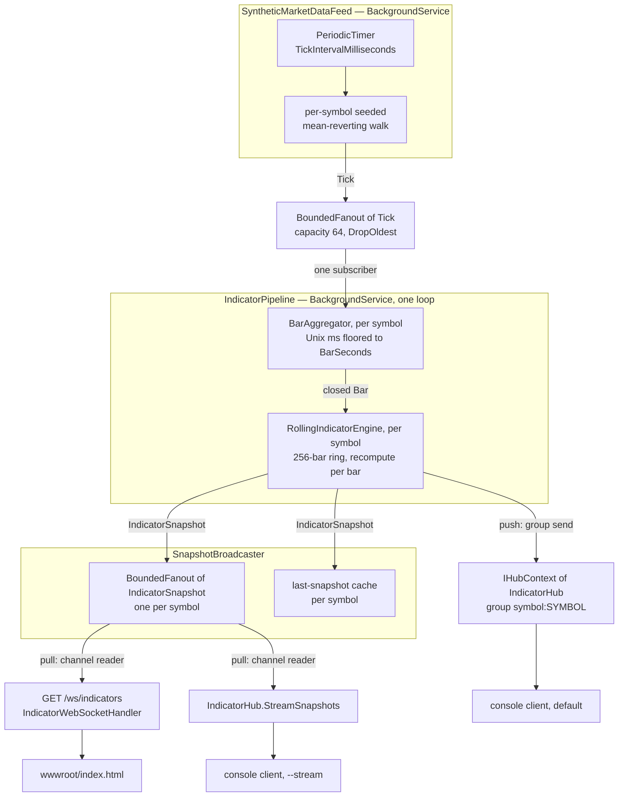

# 📡 Real-time streaming indicators

TA-Lib is a batch API: every function takes a whole array and gives you a whole array back. A live feed
is not a whole array. This guide is about the gap between those two facts, and about the sample that
closes it.

The sample lives in two projects:

| Project | What it is |
|---------|------------|
| [`samples/TechnicalAnalysis.Samples.RealTime`](../../samples/TechnicalAnalysis.Samples.RealTime) | ASP.NET Core server: synthetic tick feed → OHLCV bars → seven indicators (eleven series) per closed bar → SignalR **and** raw WebSocket, plus a zero-dependency browser dashboard |
| [`samples/TechnicalAnalysis.Samples.RealTime.Client`](../../samples/TechnicalAnalysis.Samples.RealTime.Client) | Console SignalR client that renders snapshots, exercising both server push paths |

Everything is offline and deterministic. There is no market data provider, no API key, no network egress.

---

## 📝 Table of contents

<!-- TOC -->
* [📡 Real-time streaming indicators](#-real-time-streaming-indicators)
  * [📝 Table of contents](#-table-of-contents)
  * [🏁 Run it](#-run-it)
    * [The server](#the-server)
    * [The browser dashboard](#the-browser-dashboard)
    * [The console client](#the-console-client)
  * [🏗️ Architecture](#-architecture)
    * [The pipeline, stage by stage](#the-pipeline-stage-by-stage)
  * [🔌 Transports](#-transports)
    * [HTTP endpoints](#http-endpoints)
    * [SignalR hub](#signalr-hub)
    * [Raw WebSocket](#raw-websocket)
  * [📦 Message contracts](#-message-contracts)
  * [🌡️ Warm-up and null semantics](#-warm-up-and-null-semantics)
    * [The alignment rule, which is the whole ballgame](#the-alignment-rule-which-is-the-whole-ballgame)
    * [The measured warm-up ladder](#the-measured-warm-up-ladder)
  * [⚙️ Configuration](#-configuration)
  * [🐛 Known library defects visible in this sample](#-known-library-defects-visible-in-this-sample)
  * [🏭 Production notes](#-production-notes)
    * [SignalR scale-out and the Redis backplane](#signalr-scale-out-and-the-redis-backplane)
    * [Per-connection state cost](#per-connection-state-cost)
    * [Backpressure: bounded channels, drop oldest](#backpressure-bounded-channels-drop-oldest)
      * [The push transport needs its own bound](#the-push-transport-needs-its-own-bound)
    * [Cancellation and disconnect handling](#cancellation-and-disconnect-handling)
    * [When to move to a true incremental indicator](#when-to-move-to-a-true-incremental-indicator)
    * [Things this sample deliberately does not do](#things-this-sample-deliberately-does-not-do)
<!-- TOC -->

---

## 🏁 Run it

### The server

```shell
# from the repository root — defaults to 5-second bars, 250 ms ticks
dotnet run --project samples/TechnicalAnalysis.Samples.RealTime -c Release
```

The listen URL lives in `appsettings.json` (`"Urls": "http://localhost:5199"`) rather than in
`launchSettings.json`, because `**/Properties/launchSettings.json` is gitignored repo-wide and would not
survive a clone.

For a demo you do not want to wait five seconds a bar for. Every option is overridable on the command
line:

```shell
dotnet run --project samples/TechnicalAnalysis.Samples.RealTime -c Release -- \
  --RealTime:BarSeconds=1 --RealTime:TickIntervalMilliseconds=100
```

Startup log from a real run with those overrides:

```text
info: TechnicalAnalysis.Samples.RealTime.Streaming.SyntheticMarketDataFeed[1000]
      Synthetic feed starting for 3 symbol(s) at one tick every 100 ms.
info: TechnicalAnalysis.Samples.RealTime.Streaming.IndicatorPipeline[1100]
      Indicator pipeline running: 1s bars, 256-bar window, 34 bars until every indicator is warm.
info: Microsoft.Hosting.Lifetime[14]
      Now listening on: http://localhost:5199
```

Check it is alive:

```shell
curl -s http://localhost:5199/health
```

```json
{"status":"healthy","serverTimeUtc":"2026-07-27T12:38:06.001382+00:00","uptimeSeconds":15.4,
 "symbols":["ACME","GLOBEX","INITECH"],"ticksPublished":459,"barsClosed":45,
 "tickSubscribers":1,"snapshotSubscribers":0,"groupSubscribers":0,"pushesDropped":0}
```

`snapshotSubscribers` and `groupSubscribers` count **different** things, and the split is deliberate:

* `snapshotSubscribers` counts *channel* subscribers — raw WebSocket clients and `StreamSnapshots`
  callers, i.e. everything holding a `BoundedFanout` subscription.
* `groupSubscribers` counts SignalR **push** subscriptions, one per connection per subscribed symbol.
  A connection that called `Subscribe` lives in a hub group and never touches a fanout, so it is
  invisible to the first counter. Reporting one number for both would let a leaked group membership
  hide behind a healthy-looking zero.
* `pushesDropped` counts bars the push transport gave up on. Non-zero means some subscriber stopped
  reading; see [Backpressure](#backpressure-bounded-channels-drop-oldest).

### The browser dashboard

Open <http://localhost:5199>. `UseDefaultFiles` + `UseStaticFiles` serve
`wwwroot/index.html`, a single self-contained file with no external dependencies: a canvas price line
with the two SMA overlays, a separate RSI pane with a shaded 30/70 corridor, a symbol picker, a live
status dot, exponential-backoff reconnect and a tape of recent bars.

It talks to the **raw WebSocket** endpoint, not to SignalR — which is the point: the raw endpoint has to
be good enough for a real consumer, so the sample's own page uses it.

The signature detail is the warm-up rendering. An indicator that has not produced a value yet draws as a
dashed rule with a hatched hairline that fills as bars accumulate, plus a line like
`22 more bar(s) before MACD prints.` The null-versus-warm distinction is the thing this sample most wants
you to internalise, so it is the thing the page draws most loudly.

The page builds its socket URL from the page's own origin —
`` `${location.protocol === 'https:' ? 'wss:' : 'ws:'}//${location.host}/ws/indicators${query}` `` — so
it is same-origin by construction and needs no configuration. To point it at a different server, change
that one expression in `wwwroot/index.html` (and remember that a cross-origin WebSocket is not subject to
CORS preflight, so the *server* must check `Origin` if you care).

### The console client

With the server running, in a second terminal:

```shell
# push transport (SignalR groups), the server's first symbol, until Ctrl+C
dotnet run --project samples/TechnicalAnalysis.Samples.RealTime.Client -c Release

# a specific symbol, the hub's streaming method, and a time limit
dotnet run --project samples/TechnicalAnalysis.Samples.RealTime.Client -c Release -- \
  --stream --symbol GLOBEX --seconds 8

# a server somewhere else — a root or a full hub URL both work
dotnet run --project samples/TechnicalAnalysis.Samples.RealTime.Client -c Release -- \
  http://192.168.1.20:5199
```

Real `--help` output:

```text
Usage: dotnet run [-- <server-url>] [options]

  <server-url>        Server root or full hub URL. Default: http://localhost:5199
  --symbol <symbol>   Symbol to follow. Default: the server's first symbol.
  --stream            Use the hub's streaming method instead of the group push.
  --seconds <n>       Exit after n seconds instead of running until Ctrl+C.
  --help              Show this text.
```

An interactive terminal gets an ANSI table repainted in place, with a colour-coded signal and dashed
values for nulls. Redirected output gets one greppable line per bar instead — chosen with
`Console.IsOutputRedirected`, so piping the client into `grep` produces something useful rather than a
screenful of escape codes.

The client deliberately declares its own `IndicatorSnapshotDto` rather than referencing the server
project. That way running it genuinely tests the wire contract instead of testing a shared type.

---

## 🏗️ Architecture



### The pipeline, stage by stage

**1. `SyntheticMarketDataFeed`** — a `BackgroundService` on a `PeriodicTimer`. Each symbol gets a seeded
mean-reverting geometric random walk. The per-symbol seed mixes `RandomSeed` with an FNV-1a hash of the
symbol name, *not* `string.GetHashCode`, which is randomised per process and would destroy
reproducibility across restarts. It is registered as a singleton **and** as a hosted service, so
`Subscribe()` reaches the same instance that the host is driving.

**2. `BoundedFanout<Tick>`** — one bounded channel per subscriber, `BoundedChannelFullMode.DropOldest`.
Publishing takes no lock: the subscriber array is copy-on-write, so `Publish` reads one immutable
snapshot while `Subscribe`/remove lock and swap a new array in.

**3. `BarAggregator`** — one per symbol, buckets ticks on **absolute time**: the tick's Unix millisecond
timestamp floored to the bar period (with floor-mod, so pre-epoch timestamps bucket downwards too). Two
servers started seconds apart therefore agree on bar boundaries. A bar closes when the first tick of a
*later* bucket arrives; late ticks are dropped rather than rewriting a bar a client has already charted.
`Flush()` closes the partial bar on shutdown — `IndicatorPipeline` calls it for every symbol once its read
loop exits, so the last, incomplete period is published rather than silently dropped.

One consequence worth stating: **a period with no ticks produces no bar.** With the synthetic feed that
never happens; against a real venue at 03:00 it happens constantly. Downstream code must treat bar
timestamps as a sparse series, not a metronome.

**4. `RollingIndicatorEngine`** — one per symbol, a ring buffer of the last `WindowSize` bars. On each
closed bar it unrolls the ring into chronological scratch arrays with at most two `Array.Copy` calls
(steady state allocates nothing beyond the library's own result arrays), then recomputes SMA fast, SMA
slow, EMA, RSI, MACD, Bollinger Bands and ATR over that window. See
[Warm-up and null semantics](#-warm-up-and-null-semantics) for the part that actually matters.

**5. `SnapshotBroadcaster`** — per-symbol fanouts plus a last-snapshot cache, so a client that connects
mid-period sees data immediately instead of waiting a whole bar. Symbol resolution is case-insensitive.

**6. `IndicatorPipeline`** — a single `BackgroundService` loop owns every aggregator and engine, which is
why those types can stay simple, single-threaded and lock-free. It publishes each snapshot twice: to the
broadcaster (which the pull transports read) and to a bounded queue drained by a separate pump that does
the SignalR group send (the push transport). Being an ordinary fanout subscriber, the pipeline is subject
to the same drop-oldest policy as everyone else — if it ever fell behind the feed it would skip ticks,
producing thinner bars rather than a hung server. **It never awaits a client**; see
[the push transport needs its own bound](#the-push-transport-needs-its-own-bound) for why that matters
more than it looks.

---

## 🔌 Transports

### HTTP endpoints

| Route | Method | Returns |
|-------|--------|---------|
| `/` | GET | The dashboard, `text/html` |
| `/health` | GET | `HealthResponse` JSON — status, server clock, uptime, symbols, tick and bar counters, channel and group subscriber counts, dropped-push counter |
| `/api/symbols` | GET | `["ACME","GLOBEX","INITECH"]` |
| `/hubs/indicators` | SignalR | The hub |
| `/ws/indicators?symbol=<sym>` | WebSocket upgrade | The raw socket. `symbol` is optional |

A plain `GET` on `/ws/indicators` (no upgrade header) returns **400 Bad Request** with an explanatory
body rather than a stack trace — verified.

### SignalR hub

Mapped at `/hubs/indicators`. Four server methods, one client method:

| Wire name | Signature | Notes |
|-----------|-----------|-------|
| `GetSymbols` | `() -> IReadOnlyList<string>` | Configuration order |
| `Subscribe` | `(string symbol) -> Task` | Joins group `symbol:{SYMBOL}` and immediately replays the latest snapshot to the caller. Throws `HubException` for an unknown symbol |
| `Unsubscribe` | `(string symbol) -> Task` | Leaves the group |
| `StreamSnapshots` | `(string symbol, CancellationToken) -> IAsyncEnumerable<IndicatorSnapshot>` | Per-caller bounded queue, per-caller cancellation, disposal guaranteed when the client walks away |
| `snapshot` | *client method*, invoked by the server with one `IndicatorSnapshot` | Both the group push and the replay use this name |

Symbol matching is case-insensitive. The group name is `symbol:{resolved-symbol}` — one send per group
per bar, regardless of how many clients are watching, which is what you want when thousands of browsers
follow the same instrument.

**Push versus streaming.** Push is connection-scoped: subscribe once and the server broadcasts to the
whole group. Streaming is call-scoped: each caller gets its own queue and its own lifetime. Prefer push
for fan-out, streaming when a single caller wants a request-shaped subscription it can dispose.

Minimal C# consumer of the push path:

```csharp
HubConnection connection = new HubConnectionBuilder()
    .WithUrl("http://localhost:5199/hubs/indicators")
    .WithAutomaticReconnect()
    .Build();

connection.On<IndicatorSnapshotDto>("snapshot", snapshot =>
{
    Console.WriteLine($"{snapshot.Symbol} #{snapshot.Sequence} rsi={snapshot.Rsi}");
});

// Group membership does not survive a new connection id, so re-subscribe on reconnect.
connection.Reconnected += async _ => await connection.InvokeAsync("Subscribe", "ACME");

await connection.StartAsync();
await connection.InvokeAsync("Subscribe", "ACME");
```

### Raw WebSocket

`ws://localhost:5199/ws/indicators?symbol=ACME`. Omit `?symbol=` and you get the server's first symbol.
Frames are newline-free JSON objects of `StreamMessage`: one `session` frame, then one `snapshot` frame
per closed bar.

The handler runs a receive loop concurrently with the send loop under a linked `CancellationTokenSource`.
The receive loop exists even though the protocol is one-way: without it the close handshake never
completes, and a read-only socket is exactly how a server ends up with connections that look alive to it
and dead to everyone else. The close path uses `CloseOutputAsync`, not `CloseAsync`, precisely because
the receive loop owns the read side — it then waits up to 5 s for the peer's close frame before giving
up.

Verified behaviour on the wire:

```text
$ ws /ws/indicators?symbol=ACME
HTTP/1.1 101 Switching Protocols
{"type":"session", ...}
{"type":"snapshot", ...}

$ ws /ws/indicators?symbol=NOPE
HTTP/1.1 101 Switching Protocols
{"type":"error","session":null,"snapshot":null,
 "error":"Unknown symbol. This server publishes: ACME, GLOBEX, INITECH."}
SERVER CLOSE code=1008 reason=Unknown symbol
```

`1008` is `PolicyViolation`: the socket upgrades, tells you what went wrong in a frame you can parse, and
then closes. That is friendlier than refusing the upgrade, because a browser gets no useful information
from a failed handshake.

---

## 📦 Message contracts

Copied from
[`Contracts/`](../../samples/TechnicalAnalysis.Samples.RealTime/Contracts). All JSON is camelCase,
produced by a source-generated `JsonSerializerContext` wired into all three exits (minimal API responses,
the SignalR JSON protocol, and the socket handler).

```csharp
public sealed record IndicatorSnapshot(
    string Symbol,
    DateTimeOffset Timestamp,     // UTC open instant of the bar
    decimal Close,
    long Sequence,                // per-symbol, starts at 1, monotonic
    double? SmaFast,
    double? SmaSlow,
    double? Ema,
    double? Rsi,
    double? Macd,
    double? MacdSignal,
    double? MacdHistogram,
    double? BollingerUpper,
    double? BollingerMiddle,
    double? BollingerLower,
    double? Atr,
    Signal Signal,                // serialised as a string
    int BarsInWindow,
    int BarsRequired)
{
    public bool IsWarmedUp => /* every tracked indicator has a value */;
}

public sealed record StreamMessage(
    string Type,                  // "session" | "snapshot" | "error"
    SessionInfo? Session = null,
    IndicatorSnapshot? Snapshot = null,
    string? Error = null);

public sealed record SessionInfo(
    string Symbol,
    IReadOnlyList<string> Symbols,
    int BarSeconds,
    int TickIntervalMilliseconds,
    int WindowSize,
    IndicatorPeriods Periods);
```

`Signal` is `Neutral | Bullish | Bearish | Overbought | Oversold`, serialised as a string via
`JsonStringEnumConverter<Signal>` so a browser or a Python consumer can render it without sharing an enum
definition.

A real `session` frame, captured from the socket:

```json
{"type":"session","session":{"symbol":"ACME","symbols":["ACME","GLOBEX","INITECH"],
 "barSeconds":1,"tickIntervalMilliseconds":100,"windowSize":256,
 "periods":{"smaFast":10,"smaSlow":30,"ema":20,"rsi":14,"macdFast":12,"macdSlow":26,
            "macdSignal":9,"bollinger":20,"bollingerDeviations":2,"atr":14}},
 "snapshot":null,"error":null}
```

A real `snapshot` frame, same socket, one bar later:

```json
{"type":"snapshot","session":null,"snapshot":{
  "symbol":"ACME","timestamp":"2026-07-27T12:39:02+00:00","close":341.17,"sequence":73,
  "smaFast":340.60900000000015,"smaSlow":340.827,"ema":340.4500705641675,
  "rsi":52.09158237803157,"macd":0.2751059392911088,"macdSignal":0.06660160928194875,
  "macdHistogram":0.20850433000916008,"bollingerUpper":343.07838314273073,
  "bollingerMiddle":339.8940000000001,"bollingerLower":336.7096168572695,
  "atr":6.269090362256177e+63,
  "signal":"Neutral","barsInWindow":73,"barsRequired":34,"isWarmedUp":true},"error":null}
```

That `"atr":6.269090362256177e+63` is not a typo and not a bug in the sample. See
[Known library defects](#-known-library-defects-visible-in-this-sample).

The `session` frame exists so the page can label its axes and legends from configuration instead of
hard-coding periods. The `Sequence` number exists so a client can *detect* the frames it dropped — which
a bounded stream is allowed to do.

---

## 🌡️ Warm-up and null semantics

Every indicator field is nullable, and **every null means exactly one thing: that indicator has not
produced a value for this bar yet.** A null is never replaced by zero and never by the previous bar's
value, because both of those lies are indistinguishable from a real reading once they are on the wire.

### The alignment rule, which is the whole ballgame

`TAMath` allocates its output as `new double[endIdx - startIdx + 1]` and fills it **from index 0**. The
output array is *not* parallel to the input array:

```text
output[k]  describes  input bar (BegIdx + k)     for k in [0, NBElement)
```

Elements from `NBElement` onwards are uninitialised zeros that mean nothing.

So the newest value is `output[NBElement - 1]` — never `output[lastInputIndex]`, which with a 256-bar
window and a 30-bar lookback would read 29 elements past the real data and hand back a zero dressed up as
a price. `RollingIndicatorEngine` does not merely follow that rule, it **asserts** it:

```csharp
private static double? Latest(IndicatorResult result, double[] output, int lastInputIndex)
{
    if (result.RetCode != RetCode.Success || result.NBElement <= 0)
    {
        return null;
    }

    int newestOutputIndex = result.NBElement - 1;
    int newestInputIndex = result.BegIdx + newestOutputIndex;

    if (newestInputIndex != lastInputIndex || newestOutputIndex >= output.Length)
    {
        // Returning the previous bar's value here is the classic streaming bug:
        // it looks like data and is silently one bar stale.
        return null;
    }

    double value = output[newestOutputIndex];
    return double.IsFinite(value) ? value : null;
}
```

Two guards are doing work there. The index check turns "the indicator did not cover this bar" into a null
instead of a stale number. The `IsFinite` check turns a NaN or an infinity into a null, which is why a
flat series does not put `NaN` on the wire even though the underlying RSI can produce one.

### The measured warm-up ladder

Captured from a real run against a freshly started server with `--RealTime:BarSeconds=1`, connecting the
console client immediately (columns trimmed for width):

```text
14:39:54 ACME #6   close=344.77  smaFast=null    smaSlow=null    ema=null    rsi=null   macd=null
14:39:58 ACME #10  close=339.16  smaFast=342.59  smaSlow=null    ema=null    rsi=null   macd=null
14:40:03 ACME #15  close=342.19  smaFast=341.35  smaSlow=null    ema=null    rsi=48.8   macd=null
14:40:08 ACME #20  close=340.14  smaFast=340.18  smaSlow=null    ema=325.88  rsi=46.1   macd=null    bbUpper=345.51
14:40:18 ACME #30  close=342.53  smaFast=342.75  smaSlow=341.84  ema=336.75  rsi=50.8   macd=null
14:40:22 ACME #34  close=343.29  smaFast=344.20  smaSlow=341.96  ema=339.30  rsi=51.4   macd=0.8272  macdSignal=-3.2426
```

Each first value lands exactly where the lookback says it should:

| Indicator | Config | TA-Lib lookback | First bar with a value |
|-----------|--------|----------------:|-----------------------:|
| SMA fast | 10 | 9 | 10 |
| RSI | 14 | 14 | 15 |
| ATR | 14 | 14 | 15 |
| EMA | 20 | 19 | 20 |
| Bollinger | 20 | 19 | 20 |
| SMA slow | 30 | 29 | 30 |
| MACD | 12 / 26 / 9 | 33 | 34 |

`BarsRequired` on every snapshot is `max(lookback) + 1` = **34** with the defaults, and `BarsInWindow`
tells you how far along you are. `IsWarmedUp` is the convenience: true once every tracked indicator has
a value.

**Window size versus lookback.** `WindowSize` must be strictly larger than the slowest lookback or that
indicator never fires; the constructor throws if it is not, and startup validation rejects the
configuration before the host serves. But "strictly larger" is the floor, not the target. The default is
**256**, roughly seven times the floor, and the margin is deliberate: exponentially smoothed indicators
have no exact finite lookback. TA-Lib seeds an EMA with a simple average of the first period and then
decays, so an EMA over the last 34 bars is not the same number as an EMA over the last 5 000. At 256
bars an EMA(20) retains about `(1 - 2/21)^236 ≈ 4e-11` of its seed, far below display precision. A window
of 40 would produce plausible-looking values that quietly disagree with the batch answer. **Choose the
window from the slowest smoothed indicator's decay, not from its nominal period.**

---

## ⚙️ Configuration

Everything binds from the `RealTime` section of `appsettings.json` and can be overridden on the command
line with `--RealTime:Key=Value`.

| Key | Default | Meaning |
|-----|---------|---------|
| `Symbols` | `["ACME","GLOBEX","INITECH"]` | Published symbols. The first is the page's and the client's default |
| `TickIntervalMilliseconds` | `250` | Synthetic tick interval |
| `BarSeconds` | `5` | Bar period. Ticks fold into bars aligned to this |
| `RandomSeed` | `20240613` | Seed of the price walk |
| `WindowSize` | `256` | Closed bars kept per symbol |
| `SubscriberQueueCapacity` | `64` | Items a single subscriber may buffer before the oldest is dropped |
| `Volatility` | `0.0015` | Per-tick log-return standard deviation |
| `MeanReversion` | `0.0025` | Pull back towards the symbol's base price, per tick |
| `Indicators:SmaFastPeriod` | `10` | |
| `Indicators:SmaSlowPeriod` | `30` | |
| `Indicators:EmaPeriod` | `20` | |
| `Indicators:RsiPeriod` | `14` | |
| `Indicators:MacdFastPeriod` | `12` | |
| `Indicators:MacdSlowPeriod` | `26` | |
| `Indicators:MacdSignalPeriod` | `9` | |
| `Indicators:BollingerPeriod` | `20` | |
| `Indicators:BollingerDeviations` | `2.0` | |
| `Indicators:AtrPeriod` | `14` | |
| `Indicators:RsiOverbought` | `70.0` | Signal threshold |
| `Indicators:RsiOversold` | `30.0` | Signal threshold |

Startup validation (`.Validate(…).ValidateOnStart()`) rejects an empty symbol list, a non-positive tick
interval / bar period / queue capacity, any indicator period below 2 (`TAMath` would return
`RetCode.BadParam` forever, silently nulling that indicator), and a window that is not larger than the
largest lookback. A bad configuration is a loud boot failure, not a quiet stream of nulls.

> `RealTimeOptions.Symbols` deliberately has **no** code-side default. The configuration binder *appends*
> to a non-empty collection rather than replacing it, so a code default of three symbols plus three in
> configuration binds to six — each duplicated, each with its own price walk. Startup validation catches
> the empty case instead.

---

## 🐛 Known library defects visible in this sample

These are defects in `src/TechnicalAnalysis.Functions`, not in the sample. The sample calls the library
the recommended way and reports what it gets. They are documented here because you will see them in the
output and should not spend an afternoon debugging your own code.

| Defect | Symptom here | Location |
|--------|--------------|----------|
| **ATR never divides its running average** | `atr` grows by a factor of `period - 1` every bar after the second output; the dashboard's ATR row and the client's ATR column show values like `6.27e+63` | `src/TechnicalAnalysis.Functions/Atr/TAFunc.cs`, main output loop |
| **EMA seeds itself low** | The seed sums `period - 1` values and divides by `period`, so `EMA(20)` reads `325.88` at bar 20 while every close is around `340`. The error decays with the smoothing factor, so it is invisible in steady state but distorts the first few dozen bars after warm-up. Blast radius: everything routed through `TA_INT_EMA` — Ema, Macd, MacdExt, MacdFix, Dema, Tema, T3, Apo, Ppo, Trix | `src/TechnicalAnalysis.Functions/TAFunc.cs`, `TA_INT_EMA` seed loop |
| **RSI returns `NaN` on a perfectly flat series** | Not visible in the sample, because the alignment helper rejects non-finite values and reports `null` instead. Real-world trigger: a halted instrument | `src/TechnicalAnalysis.Functions/Rsi/TAFunc.cs` |

The third one is worth dwelling on: the sample survives it **because** of the `double.IsFinite` guard in
the alignment helper. That guard is not defensive clutter; it is the reason a library defect degrades to
a missing value rather than a `NaN` rendered as a price.

---

## 🏭 Production notes

### SignalR scale-out and the Redis backplane

This sample runs one process. `IHubContext.Clients.Group(...)` only reaches connections held by *that*
process, so the moment you put two instances behind a load balancer, a client connected to instance B
stops receiving bars published by instance A.

```csharp
builder.Services
    .AddSignalR()
    .AddStackExchangeRedis("redis:6379", options =>
        options.Configuration.ChannelPrefix = RedisChannel.Literal("talib-rt"));
```

What that buys and what it costs:

* Every group send becomes a Redis publish, fanned out to every instance, which then delivers to its own
  local connections. Latency gains a network hop.
* Redis becomes a hard dependency of your *streaming* path. Plan for its failure — SignalR will surface
  it as delivery errors, not as a graceful degradation.
* The backplane does **not** shard your work. Every instance still receives every message for every
  group it has no members of. Past a certain fan-out, per-symbol topics on a real broker beat a
  chat-shaped backplane.
* If your indicators are computed per instance (as here), each instance duplicates the CPU. Compute once
  in a dedicated worker and publish snapshots onto the bus; do not scale the pipeline by scaling the web
  tier.

WebSocket sticky sessions are still required unless you disable the fallback transports, because the
SignalR negotiate step and the subsequent connection must land on the same instance.

### Per-connection state cost

A SignalR WebSocket connection is not free. Budget for, per connection:

* Two pinned-ish buffers for the transport pipes (default 64 KB each way, tunable via
  `HttpConnectionDispatcherOptions.TransportMaxBufferSize` / `ApplicationMaxBufferSize`).
* The connection's own state: id, features, claims, group memberships.
* One OS socket and its kernel buffers.

Tens of thousands of idle connections per instance is achievable; the failure mode is almost never CPU,
it is memory and file descriptors. Raise `ulimit -n`, and measure with real payload sizes rather than
empty pings.

In *this* sample there is one more per-subscriber cost: `BoundedFanout` allocates a bounded channel of
`SubscriberQueueCapacity` (default 64) references per subscriber. At 64 × 8 bytes that is negligible per
connection, but the snapshots those references keep alive are not, if a subscriber stalls with a full
queue. That is a deliberate, bounded liability — which is the next section.

### Backpressure: bounded channels, drop oldest

Every subscriber gets its own bounded channel with `BoundedChannelFullMode.DropOldest`. When a consumer
stops reading — a browser tab backgrounded, a console client at a breakpoint, a socket wedged behind a
full TCP window — its queue fills and the **oldest** queued item is discarded to make room for the newest.

This is the right policy for a market feed and the wrong one for an order feed:

* A late price is worth nothing. A consumer 40 bars behind does not want to replay 40 stale bars; it
  wants the current one.
* `BoundedChannelFullMode.Wait` would let the slowest subscriber throttle the producer and therefore
  every other subscriber. That is how one wedged client takes down a whole feed.
* An unbounded channel trades the stall for unbounded memory growth — the same outage with a longer fuse.

Dropping is not silent: `Sequence` increases by exactly one per bar per symbol, so a client that cares
can see the gap. The sample's console client counts sequence gaps for exactly this reason.

#### The push transport needs its own bound

A bounded channel only protects the paths that *go through* a channel. The SignalR push transport does
not: `IHubContext.Clients.Group(...).SendAsync(...)` fans out as `Task.WhenAll` over per-connection
`WriteAsync` calls, and each of those completes only once that connection's transport pipe has accepted
the frame. A subscriber that stops draining fills its 64 KB pipe and the send stops completing.

Awaiting that call on the tick loop — which is what the obvious implementation does — hands one wedged
client the power to stop the whole server: the loop stops consuming ticks, the upstream drop-oldest
`BoundedFanout<Tick>` discards them, and **every** symbol on **every** transport loses bars, including
clients that are reading perfectly well. The blast radius lasts until ASP.NET Core aborts the wedged
connection, which is governed by `HubOptions.ClientTimeoutInterval` — a value deployments routinely
raise, and one a client can keep resetting by sending pings while never reading.

`IndicatorPipeline` therefore gives the push path the same treatment as the pull path, twice over:

* The tick loop never awaits the hub. It hands the snapshot to a bounded drop-oldest queue with
  `TryWrite`, which cannot block and cannot throw, and moves on to the next tick.
* A separate pump drains that queue and does the group send with a 250 ms deadline. On expiry the bar
  is abandoned for that group and `pushesDropped` on `/health` goes up.

The guarantee that comes out of this is precise, and it is worth stating precisely: **a wedged
subscriber costs its own group the bars it did not read, and nothing else.** Tick consumption, bar
aggregation, the last-snapshot cache and both pull transports carry on at full rate. It is not a
guarantee that every subscriber receives every bar — that was never on offer here, and the drop-oldest
rationale above explains why it should not be.

**Anything that must not be lost — fills, cancels, risk limits — belongs on a different, acknowledged
channel.** Do not put them on a drop-oldest fanout because it happened to be there.

### Cancellation and disconnect handling

Three lessons from this sample worth stealing:

1. **Subscribe before you await.** `IndicatorPipeline` subscribes to the feed before its first `await`,
   and `StreamSnapshots` subscribes before yielding the replayed snapshot. Otherwise a bar can slip
   between the replay and the live stream and be lost forever.
2. **A one-way socket still needs a receive loop.** Without one, the close handshake never completes and
   you accumulate connections that are alive to you and dead to the peer. Use `CloseOutputAsync` (send
   half only) when another loop owns the read side; `CloseAsync` issues its own receive and will collide
   with it.
3. **Honour the token you are given.** SignalR's `[EnumeratorCancellation] CancellationToken` fires when
   the client disposes its stream, when the connection drops, *and* when the host shuts down. Honouring
   it is what makes the *streaming* subscription leak-free. Verified: after every streaming and raw
   WebSocket client disconnected, `/health` reported `"snapshotSubscribers":0`.

   That check says nothing about the **push** transport, which is the one most clients use. A group
   membership is not a channel, so it cannot show up in `snapshotSubscribers` however leaky it is;
   `IndicatorHub` therefore tracks joins and leaves explicitly and reconciles them in
   `OnDisconnectedAsync`, and `/health` reports them separately as `groupSubscribers`. Watch that
   field, not the other one, when you are looking for a leaked push subscription.

`FanoutSubscription.Dispose` is idempotent (guarded with `Interlocked`) and completes the channel so a
pending read finishes — so the usual `using` / `finally` / disconnect-handler triple call is harmless.

On the client side, `WithAutomaticReconnect()` is not enough on its own: **group membership does not
survive a new connection id**, so you must re-`Subscribe` in the `Reconnected` handler. The sample's
console client does this.

### When to move to a true incremental indicator

The sample recomputes the whole window on every bar. That is O(window) per indicator per bar — a few
microseconds for a 256-bar window and seven indicators, which is nothing next to one bar per second and
nothing next to the network hop that follows.

The alternative is genuine incremental state: a running sum for SMA, the previous value and smoothing
factor for EMA, Wilder's averages for RSI and ATR, advanced one bar at a time. O(1) per bar, and it is
what a production feed handler does.

**The trade is not performance versus elegance, it is performance versus agreement.** The moment your EMA
seeding or your RSI smoothing differs from the library's by an epsilon, your live values and your
backtest values quietly disagree, and that difference is extremely hard to find later. Window recompute
guarantees that the number a client sees is produced by the same library, on the same code path, as the
number a backtest sees.

Move to incremental when, and only when:

* the window recompute actually shows up in a profile — realistically at high bar rates (sub-second
  bars), or thousands of symbols per process, or a very large window;
* you can pin the incremental implementation with tests that assert equality against the batch values
  over a long series, including the warm-up region;
* you have decided what to do about the seed: an incremental EMA started today is not the same number as
  a batch EMA over five years of history, and you must pick which one is "correct" for your product.

A sensible middle path is to keep the window recompute and shrink the window to the smallest size whose
divergence from a long-history batch computation is below your display precision — which is the same
decay calculation as in [Warm-up and null semantics](#-warm-up-and-null-semantics), run in reverse.

### Things this sample deliberately does not do

State them out loud so nobody ships them by accident:

* **No authentication or authorisation.** The hub and the socket are open. Add `[Authorize]` and a real
  identity before this faces anything.
* **No persistence.** Restarting the server restarts the price walk and loses every bar.
* **No historical backfill.** A new subscriber gets the last snapshot and then live bars; there is no
  "give me the last 200 bars" call. Real dashboards need one.
* **No rate limiting, no connection quotas, no origin checks** on the WebSocket endpoint.
* **No TLS.** `http://localhost:5199`. Terminate TLS in front of it and use `wss://`.
* **No multi-instrument correlation, no order routing, no risk.** It computes indicators and publishes
  them. The `Signal` enum is explicitly labelled as a demonstration of combining indicator outputs, not
  as something to trade.
* **No automated tests.** `RollingIndicatorEngine`'s alignment logic and `BarAggregator`'s bucketing are
  the two pieces most worth pinning if you adapt this.

---

## Related

* [`samples/TechnicalAnalysis.Samples.RealTime/README.md`](../../samples/TechnicalAnalysis.Samples.RealTime/README.md)
  — project-local README with the file-by-file layout.
* [Getting started](getting-started.md) — `RetCode`, `BegIdx`/`NBElement` and the alignment rule in
  detail.
* [Backtesting](backtesting.md) — the same alignment rule, applied to history instead of a live feed.
* [TradingView integration](tradingview-integration.md) — repainting, realtime bars and the
  compute-on-closed-bars pattern.
